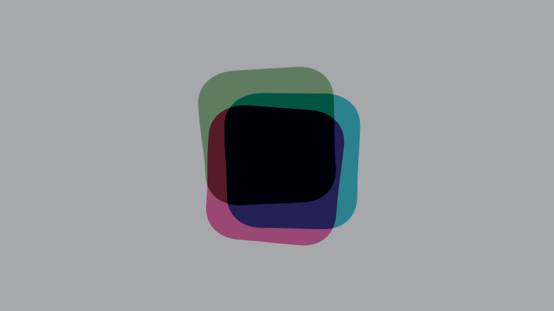

# DancingGlyphs

A screen saver for OS X that shows three ThoughtWorks glyphs dancing around.

This is work-in-progress. Plase note:

* Currently there is no configuration sheet, all configuration must be done in `Configuration.swift`

* Rendering is processor intensive. Maybe don't use this screen saver on battery power.
